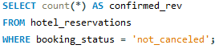
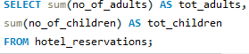

# Hotel-Reservation-Dataset-With-SQL
# Summary
Within this internship, i worked with a hotel reservation dataset to extract insights into guest preferences, booking patterns, and critical factors affecting hotel operations. Utilizing SQL, i was able to analyze the data and address particular inquiries regarding the dataset, contributing to informed decision-making and enhanced guest experiences in the hotel industry.

# Dataset Description
The dataset comprises the following columns:

1. Booking_ID: A unique identifier for each hotel reservation.
2. no_of_adults: The count of adults in the reservation.
3. no_of_children: The count of children in the reservation.
4. no_of_weekend_nights: The number of reservation nights falling on weekends.
5. no_of_week_nights: The number of reservation nights falling on weekdays.
6. type_of_meal_plan: The selected meal plan by the guests.
7. room_type_reserved: The reserved room type by the guests.
8. lead_time: The duration in days between booking and arrival.
9. arrival_date: The date of arrival.
10. market_segment_type: The market segment classification of the reservation.
11. avg_price_per_room: The average price per room in the reservation.
12. booking_status: The status of the booking.

# The task is to analyze the hotel reservation dataset using SQL by writing queries to answer specific questions. 
Below are 11 questions for which i created SQL queries to gain insights:

### Determine the total number of reservations in the dataset.
   
   
   
   

   

 ### Identify the most popular meal plan among guests.
   

   
   

   

   
### Calculate the average price per room for reservations involving children.

 
  

  
   

### Count how many reservations were made for a specific year (replace XX with the desired year).
    

 
    
    

 
    

 
### Find out the most commonly booked room type.
    

 

    

 

 
### Determine the number of reservations that fall on a weekend (where no_of_weekend_nights > 0).
 

 

 

 

 
### Identify the highest and lowest lead time for reservations.
 

 
 

 

    
### Determine the most common market segment type for reservations.
    

 
    

 

    
### Count the number of reservations with a booking status of "Confirmed."
    

 
    

 

    
### Calculate the total number of adults and children across all reservations.
    

 

 
    

    
### Determine the average number of weekend nights for reservations involving children.
    

 

    

 

    
### Determine the number of reservations made in each month of the year.
    

 
    

 

    
### Calculate the average number of nights (both weekend and weekday) spent by guests for each room type.
    

 

    

 

    
 ### Identify the most common room type for reservations involving children, and calculate the average price for that room type.
    

 

    

 
    

    
### Find the market segment type that generates the highest average price per room.
    

 
    

 
    
